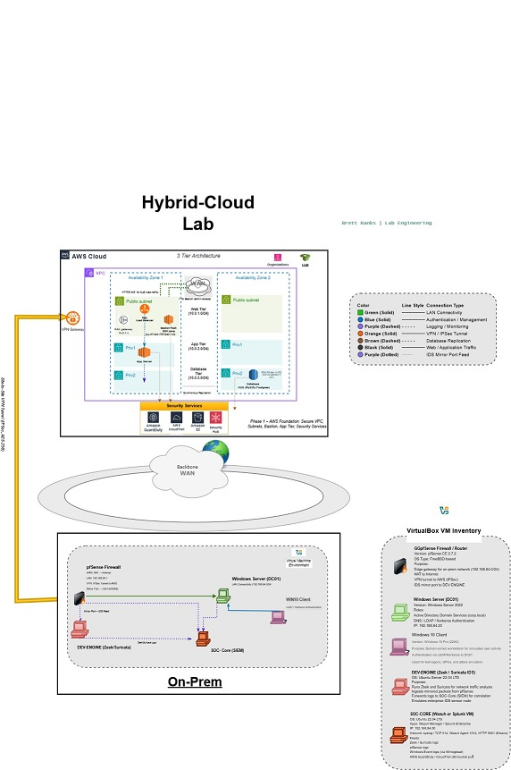
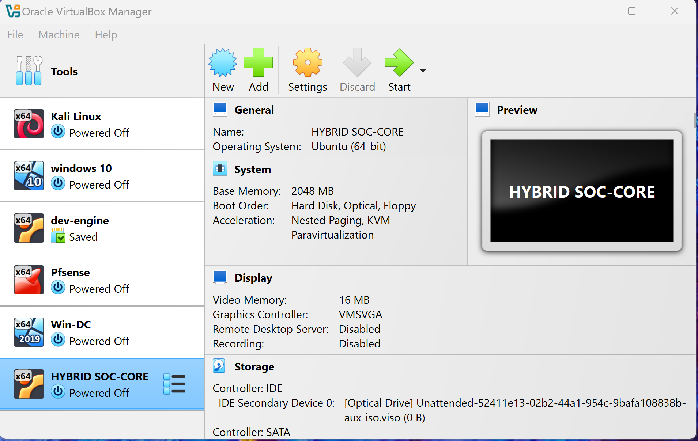
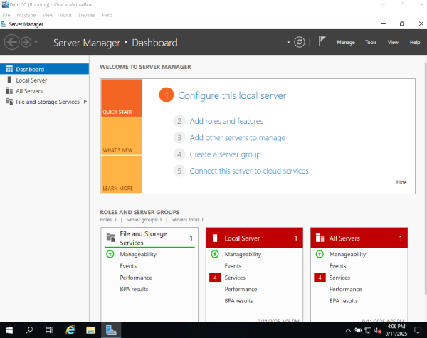
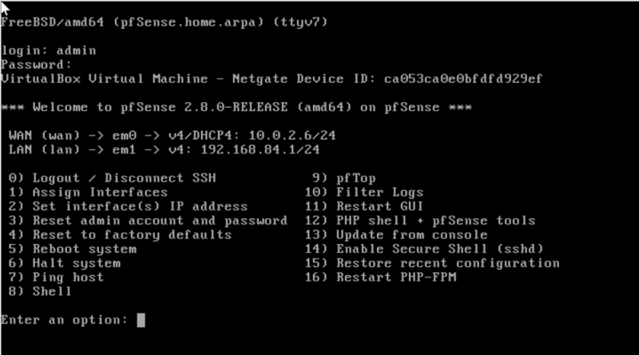
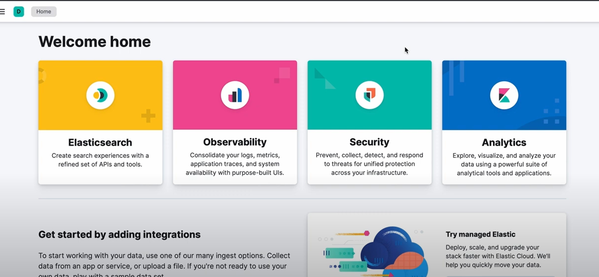

# 🛰️ Hybrid Cloud Security Lab



A complete hybrid enterprise security lab that integrates **on-prem VirtualBox infrastructure** with **AWS cloud networking**.  
This lab demonstrates secure routing, centralized authentication, intrusion detection, and cloud-native monitoring using pfSense, Active Directory, Zeek/Suricata, and ELK Stack.

---

## ⚙️ On-Prem Environment

**Platform:** Oracle VirtualBox  
**Network Segments:**
- WAN (NAT): `10.0.2.0/24`
- LAN (Host-Only): `192.168.84.0/24`

| Component | Role | IP Address | Function |
|------------|------|------------|-----------|
| pfSense | Firewall / Router | WAN 10.0.2.6 / LAN 192.168.84.1 | Segmentation, NAT, DHCP, DNS forwarding |
| Win-DC | Windows Server 2019 | 192.168.84.10 | Active Directory Domain Controller |
| Win-Workstation | Windows 10 | 192.168.84.101 | Domain-joined workstation |
| Ubuntu-dev-engine | Ubuntu 22.04 | 192.168.84.40 | Zeek / Suricata IDS node |
| Ubuntu-ELK | Ubuntu 22.04 | 192.168.84.30 | SIEM node (Elasticsearch + Kibana) |
| Kali | Kali Linux | DHCP | Red Team / Attack Simulation host |

---

## 🧩 Active Directory Integration

**Domain:** `corp.local`  
**DNS Zone:** Forward Lookup Zone — `corp.local`  
**Test User:** `labuser`

**Verification:**
Windows login → corp\labuser
Ubuntu login → su - labuser@corp.local

nslookup dev-engine.corp.local

✅ Cross-authentication between Windows and Linux validated.  
✅ DNS resolution verified bidirectionally.  

---

## ☁️ AWS Cloud Environment

**VPC Configuration**
CIDR: 10.0.0.0/16
Public Subnet: 10.0.1.0/24
Private Subnet: 10.0.2.0/24
Internet Gateway + NAT Gateway: Configured
Bastion Host: 3.135.221.242
AppServer: 10.0.2.48


**Security Groups**
- BastionSG → SSH from admin IP only  
- AppServerSG → SSH allowed only from Bastion  

---

## 📸 Key Project Screenshots

| Screenshot | Description |
|-------------|-------------|
|  | Virtual Machine's used |
|  | Windows Server AD DS configuration for domain `corp.local` |
|  | SSH tunneling from Bastion → AppServer (private subnet) |
|  | ELK SIEM dashboard visualizing hybrid log data |

---

## 📊 Phase Completion Map

| Phase | Description | Status |
|--------|--------------|--------|
| 1 | On-Prem Core Setup (pfSense + AD + DHCP/DNS) |
| 2 | Domain Integration (Linux + Windows) 
| 3 | AWS VPC + Bastion + AppServer Deployment 
| 4 | Cloud Logging & GuardDuty Configuration 
| 5 | SIEM Integration (Hybrid Correlation) 

---

## 🚀 Next Steps

- [ ] Enable organization-wide CloudTrail logging  
- [ ] Integrate GuardDuty alerts into SIEM  
- [ ] Configure hybrid log forwarding to S3  
- [ ] Add network diagrams and flow maps under `/docs/`  
- [ ] Build correlation rules for suspicious logins  

---

## 📦 Deliverables

- `Hybrid_Cloud_Security_Lab.pdf` — Full write-up  
- `Hybrid_Cloud_Security_Lab_20.html` — CherryTree export  
- `/docs/screenshots/` — Visual verification (pfSense, AD, AWS, IDS, SIEM)  
- `/docs/` — Diagrams and architecture references  
- `README.md` — Project overview (public-facing)

---

# 🔐 Hybrid Cloud Security Lab — Phase 3  
**Objective:** Build a fully auditable Hybrid Cloud Security Compliance Pipeline integrating AWS Security Services with an on-prem pfSense gateway.

---

## 🧭 Architecture Overview

| Layer | Account | Purpose | Key Components |
|-------|----------|----------|----------------|
| Mgmt | 525710163681 | Central Mgmt & Audit | CloudTrail, CloudWatch, IAM Roles |
| Security | 005235113076 | Security & Compliance | Config, Security Hub, GuardDuty, Macie, Inspector |
| Prod | 963403601837 | Workload Environment | BastionHost (10.0.1.0/24), AppServer (10.0.2.0/24) |
| On-Prem | pfSense Lab | Hybrid Gateway | Site-to-Site VPN, Firewall Logs |

---

## ⚙️ Configuration Summary

- **AWS Config → Security Hub** integration validated  
- **CloudTrail → CloudWatch** centralized logging enabled  
- **GuardDuty + Macie + Inspector** fully active in Security Account  
- **Remediations Applied:**  
  - EC2.15 – Detailed Monitoring Enabled  
  - S3.1 – Public Access Blocked  
  - IAM.7 – No Root Access Keys  
- **pfSense ↔ AWS VPN** tunnel established and verified

---

## 🧩 Step-by-Step Command Checklist

| Section | Context | Command/Action | Verification | Evidence |
|----------|----------|----------------|--------------|----------|
| GuardDuty | Security Acct CloudShell | `aws guardduty create-detector --enable` | `aws guardduty list-detectors` | Screenshot + Detector ID |
| Macie | Security Acct CloudShell | `aws macie2 enable-macie` | `aws macie2 get-macie-session` | Screenshot |
| Inspector | Security Acct CloudShell | `aws inspector2 enable --resource-types EC2 ECR` | `aws inspector2 list-findings` | Screenshot |
| CloudTrail→CloudWatch | Mgmt Acct | create log group + role + update trail | `aws cloudtrail get-trail-status` | JSON output |
| EC2 Monitoring | Security Acct | `aws ec2 monitor-instances --instance-ids <id>` | `Monitoring.State=enabled` | CLI output |
| S3 Public Block | Security Acct | `aws s3api put-public-access-block …` | `get-public-access-block` | JSON output |
| IAM Root Keys | Security Acct | `aws iam get-credential-report` | CSV shows FALSE | Screenshot |
| VPN Setup | Mgmt + pfSense | create VGW + CGW + VPN | AWS “UP” status + pfSense IKE SA established | Screenshot |
| Routing Test | Bastion/pfSense | `ping 10.0.2.48` ↔ `ping 192.168.84.1` | Bidirectional success | Screenshot |

---

## 🛰️ Network Diagram

```mermaid
graph TD
A[pfSense (192.168.84.1)] <--IPsec Tunnel--> B[AWS VGW]
B --> C[Public Subnet (10.0.1.0/24)]
C --> D[Bastion Host 3.135.221.242]
B --> E[Private Subnet (10.0.2.0/24)]
E --> F[AppServer 10.0.2.48]


---

## 🧾 Compliance Evidence

| Control             | Service                       | Evidence                      | Result |
| ------------------- | ----------------------------- | ----------------------------- | ------ |
| Config Enabled      | AWS Config                    | Screenshot of recorder active | ✅      |
| Centralized Logs    | CloudWatch                    | Screenshot of OrgTrail events | ✅      |
| Threat Detection    | GuardDuty / Macie / Inspector | “ACTIVE” status screenshots   | ✅      |
| Remediations        | EC2.15 / S3.1 / IAM.7         | CLI + Console proof           | ✅      |
| Hybrid Connectivity | pfSense ↔ AWS VPN             | Both tunnels UP + ping tests  | ✅      |

---

## 📊 Verification Commands

# Verify GuardDuty
aws guardduty list-detectors
aws guardduty get-detector --detector-id <id>

# Verify CloudTrail
aws cloudtrail get-trail-status --name <trail>

# Verify VPN Status
aws ec2 describe-vpn-connections --vpn-connection-ids <id> \
  --query "VpnConnections[0].VgwTelemetry"
ipsec statusall

---

## Lessons Learned

Centralizing compliance data across accounts simplifies audit readiness.

pfSense VPN tunnels provide realistic hybrid visibility.

Security Hub + Config form the backbone of automated detection.

CLI scripting accelerates remediation reproducibility.

---
## 📦 Next Phase (4)

Add SNS/Lambda for GuardDuty alerts

Forward CloudWatch logs to Splunk/ELK

Deploy Conformance Packs for CIS Controls

Build automated Compliance Dashboard
---
## 👤 Author

**Brett Banks**  
📍 Las Vegas, Nevada  
💻 [github.com/brettbanks](https://github.com/brettbanks)

---

## 🧱 What To Do With This README

### 1. Create Repository
```bash
cd ~/Documents/projects
mkdir hybrid-cloud-security-lab
cd hybrid-cloud-security-lab
echo "# Hybrid Cloud Security Lab" > README.md